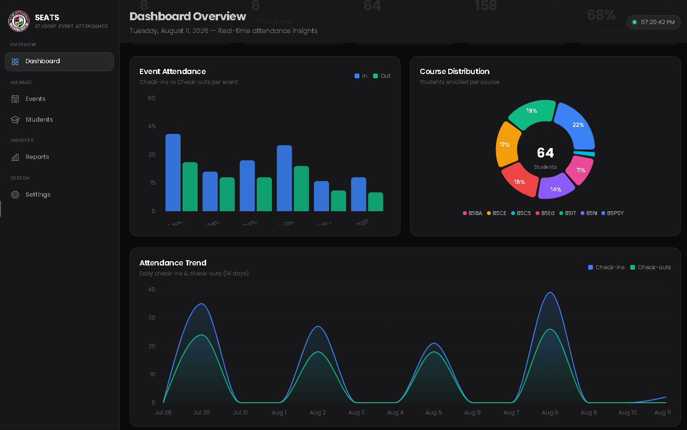
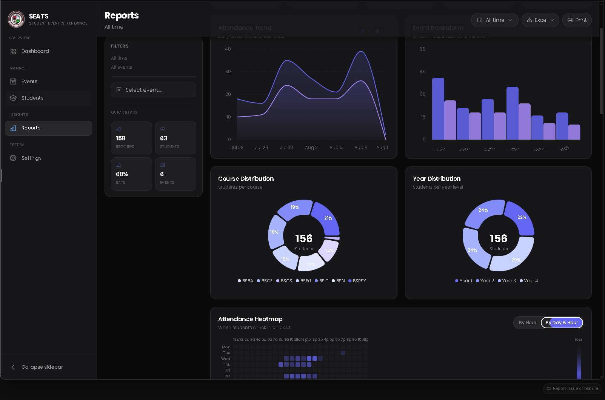

# SEATS

<p align="center">
  
</p>

<p align="center">
  <a href="package.json"></a>
  <a href="https://tauri.app/"></a>
  <a href="https://react.dev/"></a>
  <a href="https://www.rust-lang.org/"></a>
</p>

### SBO Event Attendance Tracking System

A focused desktop app for student organizations to manage events, record attendance, and turn check-in data into clear, actionable reports.

Built with **React**, **TypeScript**, **Rust**, **SQLite**, and **Tauri v2**.

<p align="center">
  <strong>Fast, private, and built for the event desk.</strong><br />
  Attendance data stays on the device while the interface keeps scanning and reporting simple.
</p>

## Preview

<table>
  <tr>
    <td width="50%">
      <p align="center"><strong>Dashboard</strong></p>
      
    </td>
    <td width="50%">
      <p align="center"><strong>Reports</strong></p>
      
    </td>
  </tr>
</table>

## What it does

- **Manage events** — create, edit, archive, and restore events with venue, schedule, and status tracking.
- **Track attendance** — record time-in and time-out scans with duplicate-scan feedback and a live attendance feed.
- **Maintain the student roster** — search, filter, sort, and bulk-import students from CSV or Excel files.
- **Understand participation** — explore dashboard trends, event summaries, distributions, leaderboards, and attendance heatmaps.
- **Export clean workbooks** — save event attendance or filtered reports as formatted `.xlsx` files through a native save dialog.
- **Run securely on desktop** — use kiosk mode, database backup/restore, auto-start preferences, and local SQLite storage.

## Architecture

SEATS is a Tauri desktop application with a React webview and a Rust command layer. The frontend communicates with the backend through Tauri's in-process IPC bridge — there is no local HTTP server or exposed API port.

```text
┌──────────────────────────────┐       Tauri IPC        ┌──────────────────────────────┐
│  client/                     │  ◄──────────────────►  │  src-tauri/                  │
│  React + TypeScript + Vite   │                        │  Rust + Tauri v2             │
│                              │                        │                              │
│  pages → components          │                        │  commands → database queries │
│  React Query → typed APIs    │                        │  SQLite → native operations  │
└──────────────────────────────┘                        └──────────────────────────────┘
                                                                  │
                                                                  ▼
                                                        Local app data directory
                                                        └── seats.db
```

### Data flow

1. Tauri initializes the local SQLite database and applies migrations.
2. The React shell mounts while the native splash screen remains visible.
3. Frontend API modules invoke typed Rust commands through `@tauri-apps/api`.
4. Rust query modules read and write the local database, returning serialized results.
5. Native features such as file dialogs, imports, backups, and Excel exports stay in the Rust layer.

## Prerequisites

- [Bun](https://bun.sh) — package manager and script runner
- [Rust](https://www.rust-lang.org/tools/install) 1.88+ toolchain
- Tauri v2 system dependencies for your operating system — see the [Tauri prerequisites guide](https://v2.tauri.app/start/prerequisites/)

## Getting started

Install dependencies from the repository root, then launch the desktop app:

```bash
bun install
cd client && bun install
cd ..
bun run dev
```

The first launch may take a few minutes while Rust dependencies and the SQLite-backed desktop shell compile.

## Build for production

```bash
bun run build
```

Build artifacts are written to `src-tauri/target/release/`.

## Scripts

### Repository root

| Command | Description |
| --- | --- |
| `bun run dev` | Start the Tauri desktop app in development mode |
| `bun run build` | Build the production desktop bundle |

### `client/`

Run these from the `client/` directory:

| Command | Description |
| --- | --- |
| `bun run dev` | Start the Vite frontend development server |
| `bun run build` | Type-check and build the frontend |
| `bun run typecheck` | Run the TypeScript project check |
| `bun run lint` | Run ESLint |
| `bun run format:check` | Verify Prettier formatting |
| `bun run preview` | Preview the production frontend build |

## Repository layout

```text
.
├── client/                 # React frontend, routes, components, API modules, and UI state
├── docs/
│   └── assets/             # README screenshots and documentation media
├── src-tauri/
│   ├── src/
│   │   ├── commands/       # Tauri IPC commands grouped by domain
│   │   └── db/             # SQLite connection, migrations, and query modules
│   ├── capabilities/       # Tauri permissions and capability manifests
│   └── tauri.conf.json     # Desktop window and bundle configuration
├── package.json            # Root scripts and Tauri CLI dependency
└── README.md
```

## Privacy and storage

SEATS is designed for local-first operation. Attendance records are stored in the app's local SQLite database, while backup and restore tools let operators control their own data files.

## License

ISC — see [`package.json`](package.json).
